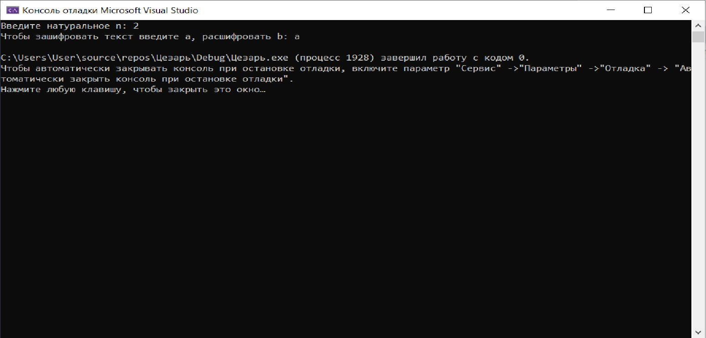

# salat
Данная программа реализует шифр цезаря путём замены каждой буквы на +n символов по алфавиту.

Приложение было раздаботано в среде Microsoft Visual Studio Community 2019.

При запуске программы мы видим консоль, которая запрашивает количество символов и направление кодирования\расходирования

Изменение шифруемого кода происходит в input.txt, куда пользователь загружает свой код 

зашифрованный текст появляется в следующем текстовом документе: output.txt

Далее, по запрому пользователя , программа создаёт текстовый документ для расшифровки( в данном случае 123.txt)

