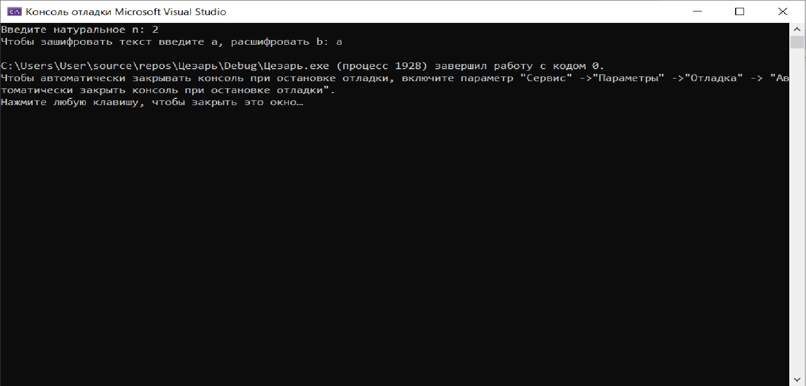
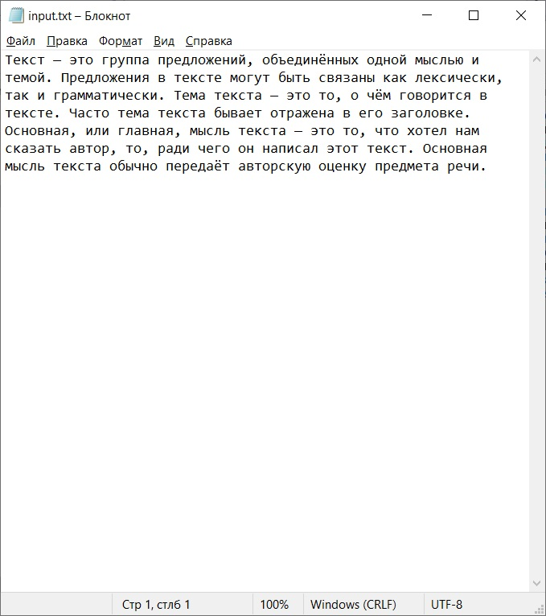
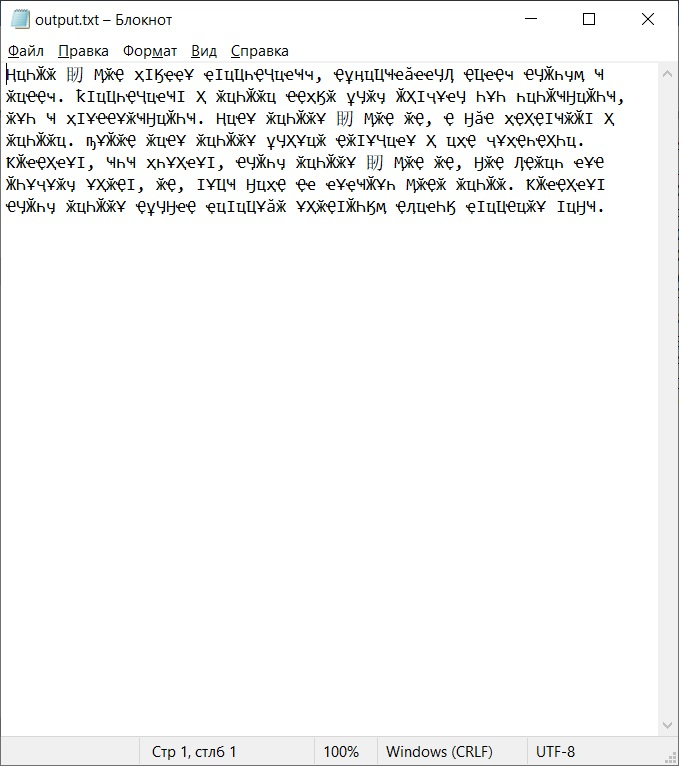
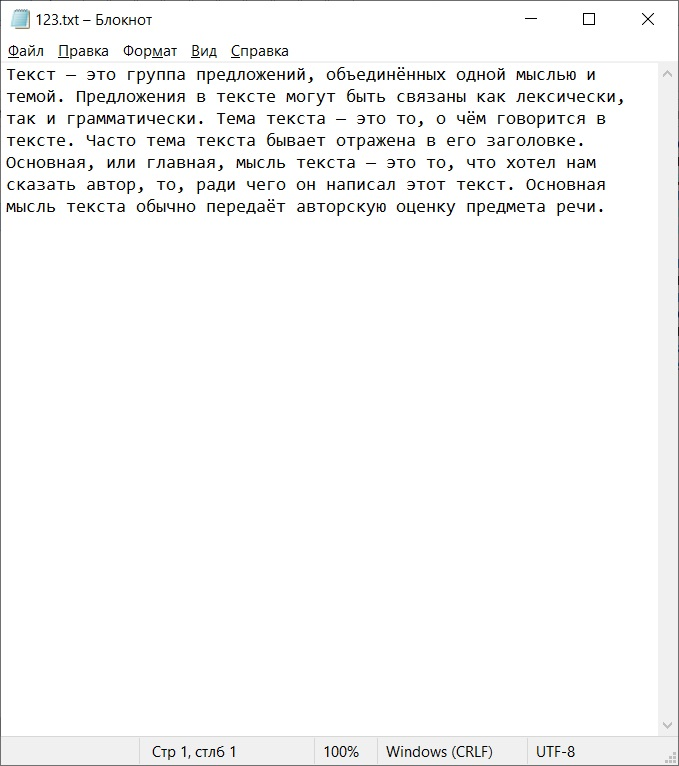

#Руководство пользования 

Данная программа реализует шифр цезаря путём замены каждой буквы на +n символов по алфавиту.

При запуске программы мы видим консоль, которая запрашивает количество символов и направление кодирования\расходирования.

При вводе "а" программа будет зашифровывать ,введённый вами в input.txt, текст.

зашифрованный текст появляется в следующем текстовом документе: output.txt

Далее, по запрому пользователя , программа создаёт текстовый документ для расшифровки( в данном случае 123.txt)

